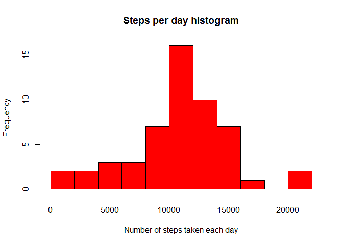
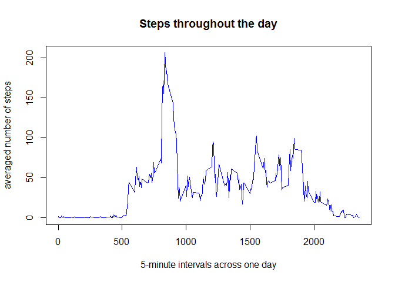
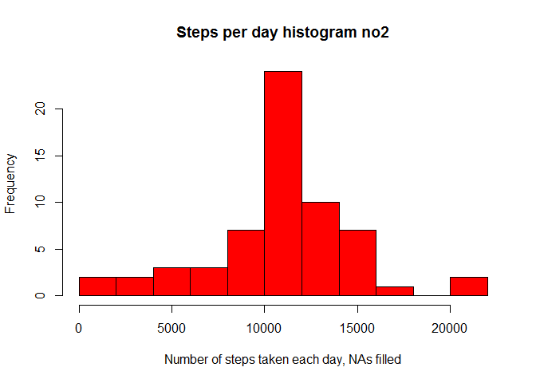
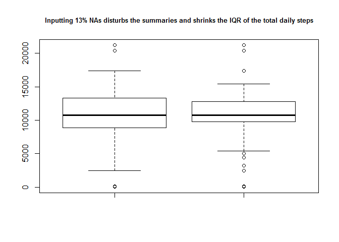
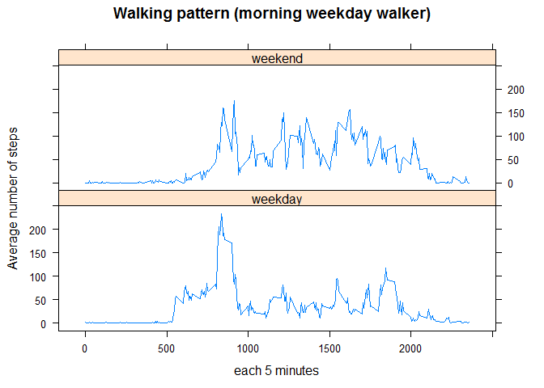

# Reproducible Research: Peer Assessment 1

This is an R Markdown document for the Reproducible Research: Peer Assessment 1  

This assignment makes use of data from a personal activity monitoring device. This device collects data at 5 minute intervals through out the day. The data consists of two months of data from an anonymous individual collected during the months of October and November, 2012 and include the number of steps taken in 5 minute intervals each day.

## Loading and preprocessing the data

```r
#download.file(url='https://d396qusza40orc.cloudfront.net/repdata%2Fdata%2Factivity.zip',
#            destfile='activity.zip')
# load the data
ds = read.csv(
            unz('activity.zip', 'activity.csv'), 
            header=T,
            colClasses = c('numeric', 'Date', 'numeric'))

# few summaries
summary(ds)
```

```
##      steps             date               interval     
##  Min.   :  0.00   Min.   :2012-10-01   Min.   :   0.0  
##  1st Qu.:  0.00   1st Qu.:2012-10-16   1st Qu.: 588.8  
##  Median :  0.00   Median :2012-10-31   Median :1177.5  
##  Mean   : 37.38   Mean   :2012-10-31   Mean   :1177.5  
##  3rd Qu.: 12.00   3rd Qu.:2012-11-15   3rd Qu.:1766.2  
##  Max.   :806.00   Max.   :2012-11-30   Max.   :2355.0  
##  NA's   :2304
```

```r
dim(ds)
```

```
## [1] 17568     3
```

```r
print(object.size(ds), units="Mb")
```

```
## 0.4 Mb
```

```r
# preprocess/transform the data into a format suitable for the analysis
# field types set already during read.csv

# ignore the missing values in the dataset
dsA = ds[!is.na(ds$steps),]

# percentages of non NAs records
print(paste0("Percentage of records with available steps: ", round(100*nrow(dsA)/nrow(ds),2) , '%'))
```

```
## [1] "Percentage of records with available steps: 86.89%"
```


## What is the mean total number of steps taken per day?

```r
# Calculate the total number of steps taken per day
dsTotal = tapply(dsA$steps, dsA$date, sum)

summary(dsTotal)
```

```
##    Min. 1st Qu.  Median    Mean 3rd Qu.    Max. 
##      41    8841   10760   10770   13290   21190
```

```r
# Make a histogram of the total number of steps taken each day
hist(dsTotal, breaks=15, main = "Steps per day histogram",
            col="red",
            xlab = "Number of steps taken each day",
            ylab = 'Frequency')
```

 

```r
# Calculate and report the mean and median of the total number of steps taken per day
print (paste("The mean   of the total number of steps taken per day is: ", round(mean(dsTotal)) ))
```

```
## [1] "The mean   of the total number of steps taken per day is:  10766"
```

```r
print (paste("The median of the total number of steps taken per day is: ", median(dsTotal) ))
```

```
## [1] "The median of the total number of steps taken per day is:  10765"
```

## What is the average daily activity pattern?

```r
# the average number of steps taken, averaged across all days (y-axis)
dsMean = aggregate(steps ~ interval, data=dsA, mean)

# a time series plot (i.e. type = "l") of the 5-minute interval (x-axis) and the average number of steps 
plot(dsMean$interval, 
            col="blue",
            dsMean$steps, 
            type="l", 
            main="Steps throughout the day", 
            xlab="5-minute intervals across one day",
            ylab="averaged number of steps")
```

 

```r
print(paste('Which 5-minute interval, on average across all the days in the dataset, contains the maximum number of steps?'))
```

```
## [1] "Which 5-minute interval, on average across all the days in the dataset, contains the maximum number of steps?"
```

```r
dsMean[which.max(dsMean$steps),]
```

```
##     interval    steps
## 104      835 206.1698
```


## Imputing missing values

```r
#Calculate and report the total number of missing values in the dataset (i.e. the total number of rows with NAs)
print(paste('The total number of missing values in the dataset:',
      sum(is.na(ds$steps)),
      'out of',
      nrow(ds),
      ' in percentage: ',
      round(100*sum(is.na(ds$steps))/nrow(ds),2)
))
```

```
## [1] "The total number of missing values in the dataset: 2304 out of 17568  in percentage:  13.11"
```

```r
# and the generalised version if you don't want to hardcode column names
colSums(sapply(ds, is.na))
```

```
##    steps     date interval 
##     2304        0        0
```

```r
#Devise a strategy for filling in all of the missing values in the dataset. The strategy does not need to be sophisticated. For example, you could use the mean/median for that day, or the mean for that 5-minute interval, etc.

#Create a new dataset that is equal to the original dataset but with the missing data filled in.
dsFull = ds

# lm() fails with a low R2, I'm using the mean for the 5-minute interval, appears more accurate than the daily mean
# looping through the 5 minute means from previous step
for (i in 1:nrow(dsMean)) {
    # extracting interval and averaged steps
    interval = dsMean[i,]$interval
    steps = dsMean[i,]$steps
    
    # writing the averaged steps to the new dsFull for all NAs that match the interval
    dsFull[ds$interval==interval & is.na(ds$steps),]$steps = steps
}
summary(dsFull)
```

```
##      steps             date               interval     
##  Min.   :  0.00   Min.   :2012-10-01   Min.   :   0.0  
##  1st Qu.:  0.00   1st Qu.:2012-10-16   1st Qu.: 588.8  
##  Median :  0.00   Median :2012-10-31   Median :1177.5  
##  Mean   : 37.38   Mean   :2012-10-31   Mean   :1177.5  
##  3rd Qu.: 27.00   3rd Qu.:2012-11-15   3rd Qu.:1766.2  
##  Max.   :806.00   Max.   :2012-11-30   Max.   :2355.0
```

```r
# trying to ignore the logical error of sum/mean of means
# a histogram of the total number of steps taken each day
dsTotal2= tapply(dsFull$steps, dsFull$date, sum)

# Make a histogram of the total number of steps taken each day 
hist(dsTotal2, breaks=15, main = "Steps per day histogram no2",
            col="red",
            xlab = "Number of steps taken each day, NAs filled",
            ylab = 'Frequency')
```

 

```r
# Calculate and report the mean and median total number of steps taken per day. 
print (paste("The mean   of the total number of steps taken per day is: ", round(mean(dsTotal2)) ))
```

```
## [1] "The mean   of the total number of steps taken per day is:  10766"
```

```r
print (paste("The median of the total number of steps taken per day is: ", median(dsTotal2) ))
```

```
## [1] "The median of the total number of steps taken per day is:  10766.1886792453"
```

```r
# Do these values differ from the estimates from the first part of the assignment? 
summary(dsTotal)
```

```
##    Min. 1st Qu.  Median    Mean 3rd Qu.    Max. 
##      41    8841   10760   10770   13290   21190
```

```r
summary(dsTotal2)
```

```
##    Min. 1st Qu.  Median    Mean 3rd Qu.    Max. 
##      41    9819   10770   10770   12810   21190
```

```r
# yes

# What is the impact of imputing missing data on the estimates of the total daily number of steps?
boxplot(dsTotal, dsTotal2, cex.names=0.5)
title("Inputting 13% NAs disturbs the summaries and shrinks the IQR of the total daily steps", cex.main=0.8)
```

 

## Are there differences in activity patterns between weekdays and weekends?

```r
#Create a new factor variable in the dataset with two levels – “weekday” and “weekend” indicating whether a given date is a weekday or weekend day.
table(weekdays(ds$date))
```

```
## 
##    Friday    Monday  Saturday    Sunday  Thursday   Tuesday Wednesday 
##      2592      2592      2304      2304      2592      2592      2592
```

```r
ds$weekday <- as.factor(
        ifelse(weekdays(ds$date) %in% c('Saturday', 'Sunday'), 'weekend', 'weekday') 
)

table(ds$weekday)
```

```
## 
## weekday weekend 
##   12960    4608
```

```r
# and the average number of steps taken, averaged across all weekday days or weekend days
dsMeanWeekday = aggregate(steps ~ weekday + interval, data=ds, mean)
library("lattice", quietly = T)

#Make a panel plot containing a time series plot (i.e. type = "l") of the 5-minute interval (x-axis) and the average number of steps taken, averaged across all weekday days or weekend days (y-axis). See the README file in the GitHub repository to see an example of what this plot should look like using simulated data.
xyplot(
    data=dsMeanWeekday,
    steps ~ interval | weekday,
    type="l",
    xlab="each 5 minutes",
    ylab="Average number of steps",
    layout=c(1,2),
    main="Walking pattern (morning weekday walker)"
)
```

 


